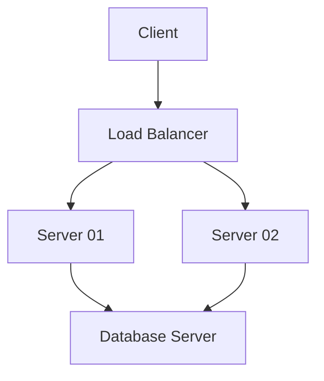

To activate it, go to `Settings/Preferences | Languages & Frameworks | Markdown`,
then check the `Mermaid` support under `Markdown Extensions`.

Here is a mermaid diagram:

```mermaid
graph TD
A[Client] --> B[Load Balancer]
B --> C[Server 01]
B --> D[Server 02]
C --> E
D --> E
E[Database Server]
```